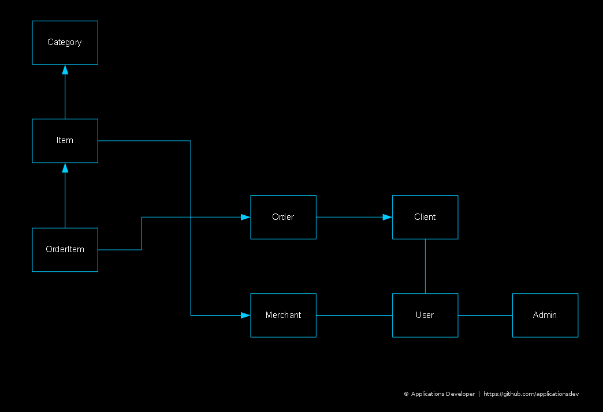

### About
Advanced RESTful API for eCommerce with Laravel & MySQL

### DBMS
Current app version is based on a single Relational Database

The database is designed according to this simplified Entity Relationship Diagram

### Get started
coming soon..

---

&copy; [Applications Developer](https://github.com/applicationsdev?tab=repositories)

Author's work is licensed under [MIT](https://opensource.org/licenses/MIT) License

Frameworks & packages are properties of their respective developers and/or owners & are licensed by them

---

Official Resources
- [Laravel](https://laravel.com/)
- [PHP](http://php.net/)
- [MySQL](https://dev.mysql.com/downloads/)
